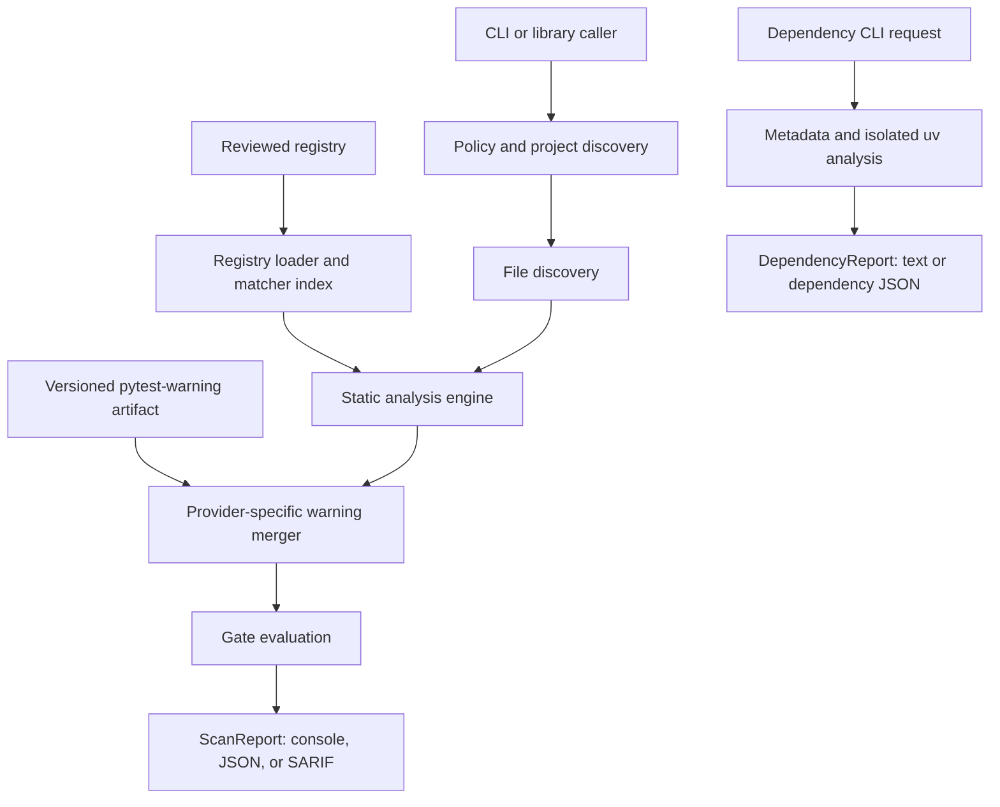

# PyAhead: Product and Technical Design

- **Status:** Implementation specification
- **Document version:** 1.1
- **Date:** 24 August 2026
- **Repository:** <https://github.com/diegorusso/pyahead>
- **Repository state at design time:** Private, empty, default branch `main`
- **Initial implementation language:** Python

This document is the implementation contract for PyAhead. It is intentionally detailed enough for Codex to implement the project in small, independently verifiable milestones. When an implementation choice conflicts with this document, either update this document in the same change with a written rationale or treat the conflict as a bug.

---

## 1. Executive summary

PyAhead is a repository-level Python compatibility forecaster.

Its core question is:

> Given the oldest Python version this repository supports, what known deprecations, removals, signature changes, behaviour changes, dependency constraints, and observed failures affect it in each subsequent Python version?

The initial command-line experience is:

```console
$ pyahead check . --baseline-python 3.11 --horizon-python 3.16

PyAhead 0.1.0
Policy: Python 3.11 through 3.16
Registry: 2026.07.31 (8e8128d)

Python 3.13 — 1 upgrade blocker
  CPY0001  src/legacy.py:4  import cgi
           Deprecated in 3.11; removed in 3.13.
           Confidence: high (exact imported module)
           Guidance: replace the required cgi functionality; no single drop-in
           replacement exists.

Python 3.16 — 1 planned migration
  CPY0042  src/events.py:19  asyncio.get_event_loop_policy()
           Deprecated; scheduled for removal in 3.16.
           Confidence: high (exact qualified call)
           Guidance: use asyncio.run() or asyncio.Runner with loop_factory.

Result: 1 blocker, 1 planned migration, 0 incomplete files
```

PyAhead is not a modernisation tool and should not duplicate pyupgrade or Ruff. Its product boundary is:

- **PyAhead:** identify what is known to become deprecated or incompatible, in which Python version, why it matters, and where the repository is affected.
- **Ruff/pyupgrade:** perform existing safe source transformations when available.
- **Tests on real interpreters:** establish executed compatibility for the paths covered by the tests.

PyAhead should link to an existing Ruff or pyupgrade fix when one exists. It should not build a general rewriting engine in its first releases.

The product consists of three layers, delivered in this order:

1. An open-source deterministic analyser and CLI.
2. A reviewed, versioned compatibility registry.
3. A static site that runs the analyser in the visitor's browser, so a repository can be scanned without installing anything.

Layers 1 and 2 shipped in `0.2`. Layer 3 is `0.3` and is described in §4.4.

An earlier revision made layer 3 a hosted GitHub App performing continuous rescans. That is not being built; §18 records the decision and what it would have added that the browser site does not.

### 1.1 Why now

As of this document, Python 3.15 is at beta 4, release candidate 1 is expected on 4 August 2026, and the final release is expected on 1 October 2026. That provides a concrete launch story: scan repositories that still support Python 3.11 or later and show their upgrade path through Python 3.15 and beyond. The schedule is contextual, not a hard-coded product assumption; release status belongs in versioned registry data.

### 1.2 Product promise

The public promise should be precise:

> PyAhead shows a repository's evidence-backed compatibility timeline across known Python releases.

It must not promise to predict arbitrary future breakage. A clean report must say:

> No known issues were detected through Python 3.16 using registry revision X. This is not proof of compatibility; run the project test suite on each target interpreter as well.

### 1.3 Initial audience

The initial audience is maintainers of actively developed Python applications and libraries that:

- support more than one Python minor version;
- upgrade Python deliberately rather than immediately;
- want advance notice of work required by the next release;
- use GitHub and CI; and
- value an auditable source for every warning.

Open-source maintainers are the adoption path. Private repositories and organisation-level reporting are the commercial path.

---

## 2. Goals and non-goals

### 2.1 Goals

The first public alpha must:

1. Analyse Python source without importing or executing the target repository.
2. Accept an inclusive baseline-to-horizon range of Python minor versions.
3. Find high-confidence uses of registry-described CPython APIs and constructs.
4. Understand common import aliases and ordinary lexical shadowing.
5. Understand common `sys.version_info` guards well enough not to flag unreachable compatibility branches as blockers.
6. Produce one finding with a version timeline, not duplicate warnings for every affected version.
7. Keep impact, matcher confidence, and registry certainty as separate dimensions.
8. Produce deterministic console, JSON, and SARIF 2.1.0 output.
9. Support configuration in `pyproject.toml`, baselines, and explicit suppressions.
10. Give every finding an authoritative source and stable rule ID.
11. Expose the coverage limits of the registry rather than implying completeness.
12. Run fully offline by default and perform no telemetry.
13. Be installable as a normal Python package and runnable with `pipx` or `uvx`.

### 2.2 Longer-term goals

After the static analyser proves useful, PyAhead should add:

- dependency compatibility checks based on `Requires-Python`, lockfiles, and isolated resolution;
- PEP 702 deprecation evidence from type checkers and installed type metadata;
- normalized runtime-warning evidence from tests;
- test and import probes on actual target interpreters in customer CI;
- C API compatibility rules;
- organisation-wide compatibility views.

### 2.3 Non-goals for the first public alpha

The first public alpha does not:

- prove that a repository is compatible with a Python version;
- execute repository code;
- install repository dependencies;
- resolve arbitrary dynamic imports or reflection;
- infer general Python types;
- comprehensively interpret prose release notes with an LLM;
- cover every PyPI package;
- analyse C extensions;
- generate pull requests or automatic fixes;
- replace a test matrix, type checker, Ruff, or pyupgrade;
- expose a plugin API that runs untrusted rule code;
- require a hosted account or network access.

---

## 3. Product vocabulary and invariants

These terms must be used consistently in code, output, and documentation.

| Term | Definition |
| --- | --- |
| **Host Python** | The interpreter running PyAhead. It is independent of the repository's supported versions. |
| **Baseline Python** | The oldest Python minor release the repository claims to support. Inclusive. |
| **Horizon Python** | The newest Python minor release the user wants assessed. Inclusive. |
| **Target set** | Every Python minor version from baseline through horizon, unless an explicit non-contiguous set is supported in a later release. |
| **Registry** | Reviewed facts about Python compatibility changes and how they can be detected. |
| **Rule** | A stable registry record describing one compatibility concern, its timeline, matchers, sources, and remediation. |
| **Change event** | A deprecation, removal, signature change, behaviour change, syntax change, or support drop at a Python version. |
| **Match** | Static evidence that a source construct corresponds to a rule's subject. |
| **Finding** | A repository-specific match combined with its reachable target versions and rule timeline. |
| **Impact** | What happens if the affected code executes: deprecation debt, compatibility risk, or breakage. |
| **Match confidence** | How strongly source analysis identified the affected object. |
| **Registry certainty** | How authoritative and settled the scheduled change is. |
| **Observed evidence** | Evidence produced by an actual interpreter, resolver, warning, import, or test run. This arrives after the static alpha. |

The following invariants are non-negotiable:

1. A rule ID is never reused for a different concern.
2. A finding always identifies the registry revision that produced it.
3. A finding never loses its authoritative source in a formatter.
4. `impact`, `match_confidence`, and `registry_certainty` are never collapsed into one ambiguous “severity” value in the internal model.
5. Static absence of findings is never represented as proof of compatibility.
6. The default scan never executes code, imports the target repository, installs dependencies, or accesses the network.
7. Repository-relative paths are used in all persistent and machine-readable output.
8. The same source, configuration, tool version, and registry revision produce byte-for-byte identical JSON and SARIF.
9. A partially completed scan is not silently treated as a successful clean scan.
10. Inference is always shown with its source and can always be overridden.

---

## 4. Scope and release sequence

### 4.1 `0.1.0a1`: end-to-end vertical slice

The first usable slice supports:

- a packaged CLI;
- explicit baseline and horizon versions;
- registry loading and validation;
- direct, aliased, and from-module imports;
- a small seed rule set, including PEP 594 module removals;
- text and JSON output;
- deterministic exit codes;
- tests from command line through rendered finding.

This release exists to validate architecture, not registry breadth.
Exact qualified-reference and qualified-call matching starts in M2 with the
matcher framework and its required shadowing and ambiguity fixtures.

### 4.2 `0.1.0a2`: useful CPython static analyser

Add:

- call-shape matchers;
- common `sys.version_info` guard analysis;
- `pyproject.toml` configuration and policy inference;
- SARIF output;
- baselines and suppressions;
- coverage manifests for official CPython sources;
- all high-confidence Python-level CPython entries representable by the supported matcher set for the initial version window;
- packaging and cross-platform hardening.

This is the first release to show to maintainers.

### 4.3 `0.2`: evidence providers

Add, behind explicit commands or configuration:

- dependency metadata and resolver evidence;
- pytest warning collection;
- evidence merging and conflict handling for the providers that exist.

`0.2.0` shipped these three. PEP 702 / type-checker evidence and
actual-interpreter compile/import/test probe ingestion were scoped here
originally and are deferred: §17 already records them as design constraints
rather than implied current features, and the first type-checker adapter is
still an open decision in §25. They move to `0.2.x`, whichever release
implements one, and neither blocks Gate D, which asks for one evidence provider
working end to end rather than for every provider this section once listed.

### 4.4 `0.3`: browser scan site — delivered

Add a static site, published through GitHub Pages from this repository's
`gh-pages` branch, where someone pastes a public repository URL and gets a
report:

- PyAhead compiled to WebAssembly through Pyodide, running in the visitor's
  browser;
- source fetched by that browser from `raw.githubusercontent.com`, with one
  `api.github.com` call to list the tree;
- the `report-v1` document rendered as a page, and offered for download;
- incompleteness shown rather than presented as a clean scan.

Nothing is submitted to a server and nothing is published about anyone's
repository, so this line carries no abuse, disclosure or retention questions. It
exists because a scan that needs no install is the cheapest way for someone to
evaluate PyAhead.

The site is static files on a branch that shares no history with `main`. It
installs `pyahead` from PyPI exactly as any other user would, so nothing on
`main` builds, imports, tests or ships it, and the two never merge.

Pyodide 314.0.6 runs Python 3.14.2 and ships `libcst 1.8.6`, which the
published `libcst>=1.8,<2` floor already accepts, so `micropip install pyahead`
resolves in the browser with no override and no change to this repository. That
was measured on an Actions runner rather than assumed, and the plan for this
line records the run.

**Delivered 17 September 2026** at `https://www.diegor.it/pyahead/`, served
from `gh-pages`. Every item above is in place, and the acceptance measurements
are in the plan for this line on the `plans` branch: the page and the installed
CLI produce identical findings for the same repository at the same commit,
three repositories of different sizes were scanned in a browser, and the
largest exceeds the cap and reports itself incomplete.

The site was delivered without a package version: it pins a published
`pyahead` and installs it from PyPI like any other user, so building it
required no change to the analyser, and a `0.3.0` that shipped no code would
have recorded a version nobody installs. `0.3.0` was released two days later
for an analyser change on this line — the registry window opening at Python
3.8 with the 3.9 and 3.10 "What's New" sections curated — which changes
inferred policy and so is a minor version. The site pins it.

This is the last planned release line before `1.0`. The hosted service that
previously held `0.3` is not being built; §18 records why.

### 4.5 `1.0`

`1.0` requires a stable registry schema, stable JSON output schema, documented compatibility guarantees, proven low false-positive rates, and at least one complete end-to-end dynamic evidence path.

---

## 5. User journeys

### 5.1 First local scan

```console
uvx pyahead check . --baseline-python 3.11 --horizon-python 3.16
```

Expected flow:

1. Locate the repository root.
2. Load explicit CLI policy.
3. Discover eligible Python files.
4. Load and validate the bundled registry.
5. Analyse every file.
6. Merge duplicate matches into findings.
7. Render the compatibility timeline.
8. Exit according to the configured gate.

The command must print the effective policy and registry revision before findings.

### 5.2 Configured repository

```toml
[tool.pyahead]
baseline-python = "3.11"
horizon-python = "3.16"
include = ["src/**/*.py", "tests/**/*.py"]
exclude = ["src/generated/**"]
source-roots = ["src"]
minimum-confidence = "high"
fail-on = "breaking"
show-unscheduled = true
respect-gitignore = true
```

Then:

```console
pyahead check
```

### 5.3 CI scan with SARIF

```console
pyahead check --format sarif --output pyahead.sarif
```

The SARIF file is valid independently of GitHub. Upload availability depends on the repository and GitHub plan. PyAhead must not assume that code scanning is enabled.

### 5.4 Existing repository adopting a baseline

```console
pyahead baseline create --output .pyahead-baseline.json
git add .pyahead-baseline.json
```

Subsequent scans can report all findings while failing CI only for new fingerprints:

```console
pyahead check --baseline-file .pyahead-baseline.json --fail-new-only
```

### 5.5 Explaining a rule

```console
pyahead explain CPY0001
```

This prints the full timeline, matcher types, remediation, sources, registry certainty, and examples without scanning a repository.

### 5.6 Browser scan site

1. Open the site and paste a public repository URL.
2. The page fetches that repository's Python files and runs the analyser in the
   browser; nothing is uploaded and no account is needed.
3. Read the report, or download it as `report-v1` JSON.
4. Install the CLI to scan on a schedule, in CI, or against private code.

The site exists to remove the install step from a first evaluation. Continuous
rescanning when the registry moves, which an installed CLI or a service would
give, is not part of it.

---

## 6. Repository layout

The repository remains one Python package with an in-tree registry. The current
top-level and package boundaries are:

```text
pyahead/
├── AGENTS.md                       # concise Codex working contract
├── .github/
│   ├── pull_request_template.md
│   └── workflows/
│       ├── ci.yml
│       └── release.yml          # trusted publishing, operator-triggered
├── docs/
│   ├── design.md                    # this document
│   ├── usage.md
│   ├── registry-authoring.md
│   ├── security-and-privacy.md
│   ├── contributing.md
│   ├── releasing.md
│   ├── corpus-review.md
│   ├── pypi-validation.md           # repo-internal PyPI top-1000 validation harness
│   ├── evidence/gate-c.md
│   └── schema/                      # public report, evidence, and registry schemas
├── src/
│   └── pyahead/
│       ├── __init__.py
│       ├── __main__.py
│       ├── _human_text.py
│       ├── _rooted_reader.py
│       ├── _windows_output.py
│       ├── baseline.py
│       ├── cli.py
│       ├── config.py
│       ├── dependencies.py          # separate dependency report pipeline
│       ├── evidence.py              # pytest-warning artifact ingestion
│       ├── model.py
│       ├── output.py
│       ├── pytest_plugin.py
│       ├── py.typed
│       ├── timeline.py
│       ├── versions.py
│       ├── analysis/
│       │   ├── __init__.py
│       │   ├── engine.py
│       │   ├── discovery.py
│       │   ├── reachability.py
│       │   ├── suppressions.py
│       │   └── matchers/
│       │       ├── base.py
│       │       ├── imports.py
│       │       ├── qualified.py
│       │       ├── calls.py
│       │       └── builtins.py
│       ├── registry/
│       │   ├── loader.py
│       │   ├── presentation.py
│       │   └── schema.py
│       ├── reporting/
│       │   ├── console.py
│       │   ├── json.py
│       │   ├── sarif.py
│       │   └── schema.py
│       └── data/
│           ├── registry/            # index, releases, rules, and coverage YAML
│           └── schema/report-v1.json
├── tests/
│   ├── unit/
│   ├── integration/
│   ├── golden/
│   └── fixtures/
│       └── rules/
├── scripts/
│   ├── benchmark.py                 # performance-budget harness
│   ├── corpus.py                    # Gate C corpus acquisition
│   ├── install_smoke.py             # wheel/sdist install verification
│   ├── pypi_corpus.py               # PyPI top-1000 manifest and acquisition
│   ├── pypi_probe.py                # target-interpreter probe payload
│   ├── pypi_validate.py             # provision, scan, and adjudicate
│   └── pypi_report.py               # aggregate accuracy report and worksheet
├── CHANGELOG.md
├── LICENSE
├── README.md
├── pyproject.toml
└── uv.lock
```

### 6.1 Packaging decisions

- Use a `src` layout.
- Require Python 3.11 or newer to run PyAhead initially.
- Target versions are independent of the host version.
- Use `uv` for development environment and lockfile management.
- Use a standards-compatible build backend such as Hatchling. Do not make installation of PyAhead depend on the user having `uv`.
- Expose the console script `pyahead = pyahead.cli:main`.
- Package registry YAML under `pyahead.data` and load it through `importlib.resources`.
- Use semantic versioning for the CLI and an independent content revision for the registry.
- Recommended licence for the open CLI and registry: Apache-2.0. Confirm before the first public release.

### 6.2 Initial dependencies

Runtime dependencies should remain small and purposeful:

| Dependency | Purpose |
| --- | --- |
| `libcst` | Lossless parsing, positions, scopes, and qualified-name metadata. |
| `packaging` | Python versions, specifiers, requirements, and markers. |
| `PyYAML` | Safe loading of human-maintained registry records. |
| `pathspec` | Gitignore-compatible file discovery. |

Development dependencies:

- Hatchling for wheel and sdist builds;
- `jsonschema` for public schema validation;
- `pytest`, `pytest-cov`, and `pytest-xdist`;
- `ruff` for lint and formatting;
- `mypy` in strict mode and `types-PyYAML` for checked YAML access.

Avoid adding a dependency when a small standard-library implementation is clearer.

---

## 7. Core architecture



The CLI is a thin adapter. Business logic must be callable as a Python library:

```python
from pathlib import Path

from pyahead.analysis import ScanRequest, scan

report = scan(
    ScanRequest(
        root=Path.cwd(),
        baseline_python="3.11",
        horizon_python="3.16",
    )
)
```

No analyser module should import Click or Rich. Formatters consume immutable report models.

### 7.1 Scan pipeline

1. Resolve repository root and configuration.
2. Establish the effective target set.
3. Load registry and release metadata.
4. Compile a matcher index keyed by matcher kind and leading module or symbol.
5. Discover source files deterministically.
6. Parse each file with LibCST.
7. Resolve positions, scopes, and possible imported qualified names.
8. Calculate per-node target-version reachability for recognized guards.
9. Run applicable matchers.
10. Convert matches into findings using rule timelines.
11. Deduplicate and fingerprint findings.
12. Apply suppressions and baseline status.
13. Record incomplete analysis diagnostics.
14. Sort deterministically.
15. Evaluate the CI gate.
16. Render the selected output.

### 7.2 Public Python API

The alpha public API is deliberately narrow:

```python
def scan(request: ScanRequest) -> ScanReport: ...

def load_registry(source: RegistrySource | None = None) -> Registry: ...
```

`ScanRequest.on_file` is the one hook into the pipeline: an optional callback
invoked after step 6 for each parsed file with a `FileProgress` (path, index,
total, incomplete). It exists so a caller that runs a long scan — the browser
page — can show progress; it receives no findings and cannot alter the scan.

Everything else is private until `1.0`. Use leading underscores or document non-stability. Do not expose raw LibCST nodes in the public result model.

### 7.3 Determinism

The core report must exclude:

- wall-clock timestamps;
- absolute paths;
- process IDs;
- unordered dictionaries or sets;
- environment-specific temporary paths;
- terminal-width-dependent text from machine formats.

Sort files by POSIX repository-relative path, findings by earliest relevant version then impact then rule ID then location, and sources in registry order.

---

## 8. Version model

### 8.1 Minor versions

The first release reasons at Python minor-version granularity. A `PythonMinor` value:

- parses only `MAJOR.MINOR`;
- is orderable and hashable;
- rejects prerelease and patch strings in policy configuration;
- currently requires major version 3;
- renders canonically as, for example, `3.13`.

Patch-specific changes may appear in evidence metadata later, but they must not be silently rounded into the minor model.

### 8.2 Target set

For baseline `3.11` and horizon `3.16`, the target set is:

```text
{3.11, 3.12, 3.13, 3.14, 3.15, 3.16}
```

Use a `frozenset[PythonMinor]` internally for reachability. The set is tiny, easy to inspect, and naturally handles Boolean guards and future non-contiguous matrices. Do not begin with complex interval algebra.

### 8.3 Release metadata

`releases.yaml` records facts used for presentation and defaults:

```yaml
schema_version: 1
releases:
  - python: "3.14"
    status: stable
    released_on: "2025-10-07"
  - python: "3.15"
    status: prerelease
    expected_final_on: "2026-10-01"
    source: "https://peps.python.org/pep-0790/"
```

Allowed statuses are `eol`, `security`, `stable`, `prerelease`, and `planned`. Dates are informative registry data and must not drive detection semantics.

### 8.4 Defaults

Policy precedence is:

1. CLI arguments.
2. `[tool.pyahead]` configuration.
3. A lower bound inferred from `[project].requires-python`.
4. Advisory inference from a consistent test matrix or Trove classifiers.
5. Otherwise, a configuration error.

The baseline must never be guessed from the host interpreter.

If the horizon is omitted, use the newest stable or actively developed Python release known by the bundled release registry, whichever is newer. Print that this was inferred and show the registry snapshot. Do not automatically include a merely planned version beyond the active development release.

The horizon must be greater than or equal to the baseline. Every requested version must fall within the registry's declared analysis window. Outside-window requests are configuration errors in the alpha, not silently partial scans. If the inferred default horizon is older than the baseline, require an explicit supported registry update or policy rather than inventing coverage.

### 8.5 Host and target separation

PyAhead may run under Python 3.11 while assessing a 3.11-to-3.16 horizon. Static rules do not require each target interpreter.

A best-effort baseline grammar check may use `ast.parse(..., feature_version=(3, minor))` when the host supports the requested feature version. Its result must be labelled best-effort. Actual grammar and runtime validation belongs to target-interpreter probes.

---

## 9. Compatibility registry

The registry is the heart of the product. A sophisticated analyser with an unreviewed or opaque registry is not useful.

### 9.1 Registry principles

- Human reviewed.
- Version controlled.
- Source linked.
- Schema validated.
- Testable independently of the analyser.
- No LLM-generated rule may be published without review.
- No arbitrary executable code in YAML.
- Every official source item is either implemented or explicitly classified in a coverage manifest.

The registry remains in the monorepo initially so a rule, matcher change, and regression test can land atomically. Split it into its own repository or package only when independent release cadence becomes a demonstrated need.

### 9.2 Rule schema

Example:

```yaml
schema_version: 1
id: CPY0001
title: "The cgi module is removed"
summary: >-
  The cgi standard-library module is deprecated in Python 3.11 and
  removed in Python 3.13.

scope:
  ecosystem: python
  runtime: cpython
  contexts: [runtime]

subject:
  kind: module
  name: cgi

timeline:
  - event: deprecated
    python: "3.11"
    certainty: released
    source: pep-0594
  - event: removed
    python: "3.13"
    certainty: released
    source: whatsnew-3.13

impact:
  on_deprecation: deprecated
  on_removal: breaking

matchers:
  - kind: module-import
    module: cgi
  - kind: literal-dynamic-import
    module: cgi
    confidence: medium

remediation:
  summary: >-
    Replace the specific cgi functionality in use. There is no single
    drop-in replacement for the complete module.
  automation: null

sources:
  - id: pep-0594
    title: "PEP 594 — Removing dead batteries from the standard library"
    url: "https://peps.python.org/pep-0594/"
  - id: whatsnew-3.13
    title: "What's New in Python 3.13"
    url: "https://docs.python.org/3.13/whatsnew/3.13.html"

tags: [stdlib, module-removal, pep-594]
```

Initial rule contexts are `runtime` and `typing`. A rule may apply to both. Future dependency and build-system rules may add an `installation` context through a schema-versioned change; do not overload `runtime` to mean installation.

### 9.3 Stable IDs

- CPython rules use `CPY` plus four decimal digits, for example `CPY0001`.
- IDs do not encode the affected Python version; schedules can change.
- Deleted or merged rule IDs remain reserved.
- A rule split creates new IDs and keeps the old ID as retired metadata.
- Rule aliases may be added for migrated IDs, but formatters always emit the canonical ID.

### 9.4 Change events

Allowed initial events:

| Event | Meaning |
| --- | --- |
| `deprecated` | Supported but discouraged; normally produces debt. |
| `removed` | API or module is unavailable from this version; normally breaking. |
| `signature_changed` | A previously accepted call form is no longer accepted or changes meaning. |
| `behavior_changed` | The same source may execute differently. |
| `syntax_changed` | Grammar or compilation behaviour changes. |
| `support_dropped` | A package or tool declares a Python version unsupported. |

Allowed registry certainty values:

| Certainty | Meaning |
| --- | --- |
| `released` | The change exists in a final Python release. |
| `scheduled` | An authoritative source assigns it to a future version. |
| `provisional` | Announced or present in prerelease development but explicitly subject to change. |

Every event has a Python version. If a rule has a deprecation event but no authoritative removal event, report that removal is unscheduled; absence of a removal event is not itself a fictional event. This keeps certainty attached only to changes that have actually happened or been announced.

If a removal is postponed, update the existing event rather than create a new rule, add the new authoritative source, and add a regression test for the corrected timeline.

### 9.5 Matcher schema

Supported declarative matcher kinds in the alpha:

1. `module-import`
   - `import cgi`
   - `import cgi as legacy_cgi`
   - `from cgi import FieldStorage`
2. `qualified-reference`
   - exact import-derived reference to a symbol;
   - optional contexts such as `read`, `decorator`, `base-class`, or `annotation`.
3. `qualified-call`
   - exact import-derived callable used as `Call.func`.
4. `call-shape`
   - a qualified call plus predicates over positional count, keyword presence, literal values, or omitted arguments.
5. `literal-dynamic-import`
   - `importlib.import_module("cgi")` or `__import__("cgi")` with a literal string;
   - medium confidence by default.
6. `builtin-pattern`
   - a whitelisted built-in analyser for syntax or value shapes that cannot be expressed safely in YAML.

A `builtin-pattern` references a known implementation identifier such as `bool-bitwise-inversion`. Registry data cannot provide a module path or arbitrary callable.

### 9.6 Remediation

Remediation fields may include:

```yaml
remediation:
  summary: "Use inspect.iscoroutinefunction()."
  documentation_url: "https://docs.python.org/..."
  automation:
    tool: ruff
    rule: UP999
```

Never claim an automatic fix unless the referenced tool and rule are verified. Do not estimate time-to-fix.

### 9.7 Sources

Preferred sources, in order:

1. Python documentation for the affected release.
2. Accepted PEPs.
3. CPython documentation's centralized deprecation index.
4. CPython issues or merged changes when the first three are insufficient.
5. Official package documentation for third-party rules later.

Each source has a stable local ID, title, and direct URL. A rule must contain at least one source. Future scheduled events require an authoritative source that names the version.

### 9.8 Coverage manifests

Completeness must be auditable. For every curated source page, add a coverage manifest:

```yaml
schema_version: 1
source:
  id: python-deprecations-3.14
  url: "https://docs.python.org/3/deprecations/index.html"
  checked_on: "2026-07-31"

entries:
  - source_key: "pending-3.16-asyncio-iscoroutinefunction"
    disposition: implemented
    rules: [CPY0042]

  - source_key: "pending-3.15-import-system-cached"
    disposition: not-statically-detectable
    note: "Requires runtime module-state inspection."

  - source_key: "pending-3.15-pyweakref-getobject"
    disposition: c-api-roadmap
    note: "Excluded from the Python-source alpha."
```

Allowed dispositions:

- `implemented`;
- `partial`;
- `not-statically-detectable`;
- `dynamic-evidence-roadmap`;
- `c-api-roadmap`;
- `duplicate`;
- `not-applicable`.

Registry CI fails when a referenced source entry has no disposition or when an `implemented` entry points to a missing rule.

### 9.9 Registry revision

Compute the registry revision as a SHA-256 digest of canonicalized registry and release files. Expose both:

- a human release label such as `2026.07.31`; and
- a short content digest such as `8e8128d`.

Every report includes both.

---

## 10. Static analysis engine

### 10.1 File discovery

Default discovery:

- scan `*.py` and `*.pyi` beneath the repository root;
- respect `.gitignore` when present;
- exclude `.git`, `.venv`, `venv`, `build`, `dist`, cache directories, and common generated directories;
- do not follow directory symlinks;
- do not follow a file symlink that resolves outside the repository root;
- skip files above 2 MiB by default and emit an incomplete-analysis diagnostic;
- normalize all report paths to repository-relative POSIX form.

Normal `.py` source begins in both runtime and typing contexts because it is executed by Python and analysed by type checkers. Stub `.pyi` source begins in typing-only context. The engine also recognizes import-derived `typing.TYPE_CHECKING` guards: the true branch is typing-only and the false branch is runtime-only. A registry rule declares the contexts in which it applies, so a runtime-only CPython removal is not incorrectly reported as a runtime blocker for an import that exists only in a stub or `TYPE_CHECKING` branch.

Includes and excludes are evaluated in documented order:

1. built-in exclusions;
2. gitignore rules if enabled;
3. configured includes;
4. configured excludes, which win.

File order is lexical by normalized path.

### 10.2 Parsing

Use LibCST because positions, formatting, imports, scopes, comments, and qualified-name metadata are all valuable to detection and suppression.

For each source file:

1. Read bytes and detect Python source encoding according to Python rules.
2. Parse with LibCST.
3. Wrap with metadata providers:
   - `PositionProvider`;
   - `ParentNodeProvider`;
   - `ScopeProvider`;
   - `QualifiedNameProvider`.
4. Collect syntax, suppression, reachability, and match evidence in one coordinated traversal where practical.

Parse failure produces a diagnostic containing path, location, and parser message. By default, any unexcluded parse failure makes the scan incomplete and produces exit code 3 even if other files were analysed. `--allow-incomplete` may downgrade that to a warning, but output must still state that the scan was incomplete.

### 10.3 Qualified-name resolution

Recognize ordinary aliasing:

```python
import locale as loc
loc.getdefaultlocale()

from locale import getdefaultlocale as get_locale
get_locale()
```

Use import-derived qualified names from LibCST. Confidence rules:

- **high:** exactly one applicable import-derived qualified name matches the registry subject and no competing imported target is possible;
- **medium:** the subject is one of multiple possible import-derived names, or the match is a literal dynamic import;
- **low:** heuristic text or attribute shape without reliable binding.

The alpha emits high-confidence findings by default. Medium findings are available with configuration. Low-confidence matching should not be implemented until there is a specific, validated use case.

Lexical shadowing must not produce a false exact match:

```python
import locale

def f(locale):
    locale.getdefaultlocale()  # not an imported locale reference
```

Star imports are unresolved by default. Do not pretend that an unqualified name from `import *` is exact.

Build a project-module index from discovered source roots before analysing imports. Configured `source-roots` are authoritative. Otherwise, infer only conventional repository-root and `src/` layouts and expose the inference in the report. Explicit relative imports are local. If an absolute import could resolve to a repository module that shadows a standard-library or third-party name, treat it as ambiguous rather than high confidence. Uncertain packaging layouts must reduce confidence, not fabricate an origin.

The M6 precision review adds one deliberately narrow dynamic-path exception.
When the coordinated traversal observes an exact import-derived
`sys.path.insert(...)` or `sys.path.append(...)`, build a second conservative
index of nested repository `.py` basenames which such a directory could expose
as top-level modules. Do not evaluate or trust the path argument. A matching
`insert` reduces the affected import origin to medium confidence for the whole
target window. A matching `append` leaves a removed standard-library module
high confidence only while the standard-library module still exists; at and
after removal its origin is ambiguous. Emit `PYA2001` with the candidate paths
and mutation locations. Shadowed `sys` lookalikes, unrelated nested modules,
and attribute-removal rules must not trigger this exception.

### 10.4 Match collection

An internal `StaticMatch` contains:

```python
EvidenceValue = str | tuple[str, ...]

@dataclass(frozen=True)
class StaticMatch:
    rule_id: str
    matcher_kind: str
    path: PurePosixPath
    region: SourceRegion
    enclosing_scope: str
    subject: str
    confidence: MatchConfidence
    reachable_versions: frozenset[PythonMinor]
    usage_contexts: frozenset[UsageContext]
    evidence: tuple[tuple[str, EvidenceValue], ...]
```

`evidence` contains only structured, formatter-safe facts such as resolved
qualified names and call keyword names. M1 stores deterministic immutable
key-value pairs and serializes them as a JSON mapping; it must not contain LibCST
objects.

### 10.5 Matcher index

Do not visit every node once per rule. Compile indexes:

- module-import rules by top-level module;
- qualified rules by terminal name and full name;
- call-shape rules by full callable name;
- built-in patterns by visitor hook.

The engine visits each file once and asks only relevant matcher groups to inspect a node.

### 10.6 Deduplication

Multiple matchers may identify the same construct. Deduplicate by rule, file, source region, and canonical subject. Keep the strongest confidence and union non-conflicting evidence.

Do not merge distinct call sites merely because they use the same rule.

---

## 11. Version-guard reachability

Ignoring version guards would create exactly the sort of false positives that destroys trust.

### 11.1 Required alpha patterns

Recognize comparisons involving import-derived `sys.version_info` and aliases:

```python
import sys
if sys.version_info >= (3, 13): ...

from sys import version_info as py_version
if py_version < (3, 13): ...

if sys.version_info[:2] == (3, 12): ...
if not (sys.version_info >= (3, 14)): ...

if sys.version_info >= (3, 13) and feature_enabled: ...
```

Support `<`, `<=`, `>`, `>=`, `==`, `!=`, parentheses, `not`, `and`, and `or`.

Also recognize import-derived `typing.TYPE_CHECKING` and aliases. Its true branch is typing-only and its false branch is runtime-only. Apply the same conservative rule to unknown aliases: uncertain context must not be used to suppress a finding.

Recognize one additional removal-safe short-circuit shape:

```python
import ast
if hasattr(ast, "NameConstant") and use(ast.NameConstant): ...
```

The callable must resolve exactly to built-in `hasattr`, its first argument
must resolve exactly to the imported module that owns the matched attribute,
and its second argument must be the same literal attribute name. Only access in
the right-hand side of that `and` (including a longer all-`and` chain) is
unreachable from the rule's removal version onward. Deprecation debt before
removal remains visible. Shadowed `hasattr`, a different literal, `or`, and
non-literal reflection remain unknown.

### 11.2 Evaluation algorithm

Evaluate a recognized condition independently for every target minor version. The result for each target is `true`, `false`, or `unknown`.

For an `if` statement with active version set `A`:

```text
true branch  = versions in A where condition is true or unknown
false branch = versions in A where condition is false or unknown
```

Unknown enters both branches. This is conservative: it may retain a finding, but it does not hide one.

For Boolean operations, use three-valued logic. For example, `known_false and unknown` is false, while `known_true and unknown` is unknown.

Handle `if`/`elif`/`else` sequentially so an `elif` receives only versions not definitely handled by preceding branches.

### 11.3 Example

```python
import sys

if sys.version_info < (3, 13):
    import cgi
else:
    from replacement import parse_form
```

For a 3.11-to-3.16 target set, the `cgi` import is reachable only on 3.11 and 3.12. Its removal in 3.13 is therefore not an upgrade blocker. It may still be reported as deprecation debt for 3.11–3.12.

### 11.4 Explicit limitations

The alpha treats these as unknown:

- patch-level guards such as `sys.version_info >= (3, 13, 2)`;
- user-defined version constants;
- helper functions that hide version checks;
- string comparisons of `platform.python_version()`;
- Boolean expressions that mix `TYPE_CHECKING` with runtime version or feature predicates beyond a direct `not`;
- conditions dependent on environment variables or package versions;
- general control-flow reachability beyond lexical guards.

The exact `hasattr(module, "attribute") and ...` shape above is part of the
lexical grammar; it is not a claim to infer general attribute or control-flow
reachability.

Add support only with positive and negative fixtures. Never infer target unreachability from a condition the engine does not understand.

---

## 12. Finding and report model

### 12.1 Finding lifecycle

A source match and rule timeline produce one finding. Its `states` summarize contiguous portions of the reachable target set:

```json
{
  "rule_id": "CPY0001",
  "states": [
    {"from": "3.11", "through": "3.12", "state": "deprecated"},
    {"from": "3.13", "through": "3.16", "state": "breaking"}
  ]
}
```

Initial states:

| State | Meaning |
| --- | --- |
| `deprecated` | The usage remains available but is deprecated. |
| `risk` | A signature, behaviour, or environment change may affect execution. |
| `breaking` | The matched usage is unavailable or invalid in the target version. |
| `informational` | Relevant future or unscheduled information that is not currently gated. |

If the usage is unreachable for a target version, that version does not appear in the finding state.

### 12.2 Internal model

```python
@dataclass(frozen=True)
class Finding:
    fingerprint: str
    rule_id: str
    title: str
    path: PurePosixPath
    region: SourceRegion
    enclosing_scope: str
    subject: str
    match_kind: str
    match_confidence: MatchConfidence
    match_evidence: tuple[tuple[str, EvidenceValue], ...]
    usage_contexts: tuple[UsageContext, ...]
    reachable_versions: tuple[PythonMinor, ...]
    states: tuple[FindingStateRange, ...]
    remediation: Remediation
    sources: tuple[SourceReference, ...]
    suppression: Suppression | None
    baseline_status: BaselineStatus
```

`ScanReport` contains:

- tool and schema versions;
- registry release and digest;
- effective policy and provenance;
- scanned root label, never absolute path;
- file counts;
- findings;
- diagnostics;
- analysis inferences and their provenance;
- summary counts;
- gate configuration and result.

### 12.3 Impact and confidence

Keep these separate in every machine format:

```text
impact: breaking
match_confidence: high
registry_certainty_by_event: {deprecated: released, removed: scheduled}
```

Certainty belongs to the event or derived state range because one rule can contain a released deprecation and a scheduled removal. A formatter may present a summary certainty, but it must retain the per-event values. A future scheduled removal can be high-confidence static evidence and breaking impact while still being scheduled rather than released.

### 12.4 Stable fingerprints

Fingerprint version 1 is:

```text
sha256(
  "pyahead-fingerprint-v1\0" +
  rule_id + "\0" +
  repository_relative_path + "\0" +
  enclosing_scope + "\0" +
  canonical_subject + "\0" +
  occurrence_ordinal_within_scope
)
```

The occurrence ordinal counts matches for the same rule and subject within the enclosing scope, not physical lines. This survives unrelated line insertions better than a line-based hash.

Tests must cover:

- adding blank lines above a finding does not change it;
- renaming the containing function does change it;
- renaming or moving the source file changes it and is a documented baseline limitation;
- adding a preceding same-rule match within the same scope changes later ordinals and is documented as a limitation;
- normalized path separators are stable across platforms.

Use the fingerprint in SARIF `partialFingerprints` and baseline files.

### 12.5 Baseline file

```json
{
  "schema_version": 1,
  "created_by": "pyahead 0.1.0",
  "registry_revision": "...",
  "findings": [
    {
      "fingerprint": "...",
      "rule_id": "CPY0001",
      "path": "src/legacy.py",
      "subject": "cgi"
    }
  ]
}
```

The registry revision is informative; a baseline remains usable after registry changes. A finding with a new fingerprint is new even if its rule ID already exists in the baseline.

### 12.6 Suppressions

Support:

```python
import cgi  # pyahead: ignore[CPY0001] -- migration tracked in issue 42
```

and configuration:

```toml
[tool.pyahead.per-file-ignores]
"tests/fixtures/**" = ["CPY0001", "CPY0002"]
```

Rules:

- an inline suppression applies to findings whose primary region touches that logical statement;
- a rule ID is mandatory;
- a reason after `--` is recommended but not required in the alpha;
- unknown rule IDs are diagnostics;
- suppressed findings remain available in JSON with `suppressed: true` when `--show-suppressed` is used;
- suppressions do not erase incomplete-analysis diagnostics.

Do not reuse `# noqa`; PyAhead's semantics and timelines are distinct.

---

## 13. Configuration and project inference

### 13.1 Configuration schema

```toml
[tool.pyahead]
baseline-python = "3.11"
horizon-python = "3.16"
include = ["src/**/*.py", "tests/**/*.py"]
exclude = ["**/generated/**"]
source-roots = ["src"]
respect-gitignore = true
minimum-confidence = "high"
fail-on = "breaking"
show-unscheduled = true
max-file-size-bytes = 2097152

[tool.pyahead.per-file-ignores]
"tests/fixtures/**" = ["CPY0001"]
```

Unknown keys are configuration errors. This catches spelling mistakes instead of silently ignoring them.

### 13.2 Merge semantics

- Scalars: CLI replaces configuration.
- Lists: CLI replaces rather than appends unless the option explicitly says `--add-*`.
- Per-file ignores: merge by pattern, with CLI-specific ignores added.
- Explicit `--no-*` flags override true configuration values.

Print effective configuration under `--verbose` and expose it in JSON.

### 13.3 Baseline inference

From:

```toml
[project]
requires-python = ">=3.11"
```

infer baseline `3.11` with provenance `project.requires-python`.

For complicated specifiers:

- use `packaging.specifiers.SpecifierSet`;
- find the lowest included Python minor from the registry's supported analysis range;
- reject a specifier with no supported included minor;
- if the lower boundary is patch-specific, report the exact declaration and explain that PyAhead analyses at minor granularity;
- never infer a baseline solely from Trove classifiers when they conflict with `requires-python`.

CI matrices, Tox, Nox, and classifiers are advisory in the alpha. If they agree and no authoritative baseline exists, PyAhead may suggest a value, but non-interactive `check` should fail with a clear instruction rather than silently adopt it.

### 13.4 Repository root

Resolve root in this order:

1. Explicit `--root`.
2. Nearest ancestor containing `pyproject.toml`.
3. Nearest Git worktree root.
4. Current directory.

Configuration discovery stops at the selected root.

---

## 14. CLI contract

### 14.1 Commands

```text
pyahead check [PATHS...]
pyahead explain RULE_ID
pyahead baseline create
pyahead registry validate
pyahead registry list
pyahead registry coverage
pyahead version
```

Use `pyahead --version` as an alias for `pyahead version`.

### 14.2 `check` options

Core options:

```text
--baseline-python VERSION
--horizon-python VERSION
--config PATH
--root PATH
--registry PATH
--format text|json|sarif
--output PATH
--minimum-confidence high|medium
--fail-on never|breaking|risk|deprecated|any
--baseline-file PATH
--fail-new-only
--show-suppressed
--allow-incomplete
--verbose
--quiet
```

`--output -` means standard output. Without `--output`, text goes to stdout and machine formats go to stdout. Diagnostics that would corrupt JSON/SARIF go to stderr.

### 14.3 Exit codes

| Code | Meaning |
| ---: | --- |
| `0` | Scan completed and no finding met the configured failure gate. |
| `1` | Scan completed and one or more findings met the gate. |
| `2` | Invalid command line, configuration, or registry input. |
| `3` | Analysis was incomplete because one or more eligible files could not be read or parsed. |
| `4` | Unexpected internal error. |

`--allow-incomplete` permits exit 0 or 1 instead of 3, but the report retains prominent incomplete diagnostics.

### 14.4 Gate semantics

Impact ordering for gate purposes:

```text
informational < deprecated < risk < breaking
```

- `never`: findings never cause exit 1.
- `breaking`: fail on breaking findings only; default.
- `risk`: fail on risk or breaking.
- `deprecated`: fail on deprecated, risk, or breaking.
- `any`: fail on every unsuppressed finding, including informational.

`--fail-new-only` evaluates only findings absent from the baseline file. It does not hide existing findings from output.

### 14.5 Text output

Text output is optimized for a human terminal:

- timeline grouped by earliest actionable Python version;
- concise summary at top and bottom;
- one primary location per finding;
- source and full explanation available without network through `pyahead explain`;
- colour only on a TTY and when `NO_COLOR` is not set;
- `--quiet` prints only a one-line summary and errors.

Avoid animation and progress bars in CI.

---

## 15. JSON and SARIF contracts

### 15.1 JSON

Top-level shape:

```json
{
  "schema_version": 1,
  "tool": {"name": "pyahead", "version": "0.1.0"},
  "registry": {"release": "2026.07.31", "revision": "..."},
  "policy": {
    "baseline_python": "3.11",
    "horizon_python": "3.16",
    "versions": ["3.11", "3.12", "3.13", "3.14", "3.15", "3.16"],
    "provenance": {"baseline_python": "pyproject.toml:project.requires-python"}
  },
  "scan": {
    "files_discovered": 42,
    "files_analyzed": 42,
    "files_incomplete": 0
  },
  "summary": {
    "breaking": 1,
    "risk": 0,
    "deprecated": 2,
    "informational": 0,
    "suppressed": 0,
    "new": 1
  },
  "findings": [],
  "diagnostics": [],
  "inferences": [],
  "gate": {"fail_on": "breaking", "new_only": false, "failed": true}
}
```

Publish a JSON Schema under `docs/schema/report-v1.json` before calling the format stable. Additive optional fields are allowed within schema version 1; removals or semantic changes require schema version 2.

### 15.2 SARIF

Emit SARIF 2.1.0 using GitHub's supported subset:

- one run;
- tool driver name and semantic version;
- one rule descriptor per emitted rule;
- repository-relative artifact URIs;
- exact regions;
- `ruleId` equal to the stable PyAhead rule ID;
- `partialFingerprints.pyahead/v1` equal to the finding fingerprint;
- impact mapped to SARIF levels:
  - `breaking` → `error`;
  - `risk` → `warning`;
  - `deprecated` and `informational` → `note`;
- match confidence, per-event registry certainty, usage contexts, version states, and registry revision in result properties;
- help URI pointing to stable hosted rule documentation when available, otherwise the primary authoritative source.

GitHub relies on stable rule IDs, paths, and fingerprints to avoid duplicate code-scanning alerts. Golden tests must validate these fields.

### 15.3 Machine-format errors

If JSON or SARIF was requested and configuration fails before a report can be constructed:

- write no partial machine document to stdout;
- write a concise error to stderr;
- exit 2, 3, or 4 as appropriate.

If an output file was requested, write to a temporary sibling and atomically replace the destination only after successful serialization.

---

## 16. Initial rule coverage

### 16.1 Supported version window

The first useful registry targets repositories with a baseline of Python 3.11 or newer and a horizon through the newest authoritative future version represented by curated data.

The architecture must not hard-code 3.11. Older baselines can be added by registry curation and parser testing.

### 16.2 Seed sources

Start with:

- PEP 594 module removals;
- released “Removed” and “Deprecated” sections for Python 3.12, 3.13, and 3.14;
- the centralized Python deprecation index for scheduled 3.15, 3.16, and later removals;
- relevant accepted PEPs linked by those pages.

### 16.3 Seed rule priorities

Implement in this order:

1. Whole-module removals, because matching is precise and impact is clear.
2. Exact function/class/attribute removals reachable through imports.
3. Changed call forms expressible through call-shape predicates.
4. Simple literal/syntax patterns with a dedicated built-in matcher.
5. Partial patterns only when output clearly describes the limitation.

Do not set an arbitrary rule-count target. The acceptance criterion is that every entry in each selected authoritative source is classified in a coverage manifest, and every `implemented` rule has positive and negative fixtures.

### 16.4 Example fixture matrix

For a module rule:

```text
tests/fixtures/rules/CPY0001/
├── positive/
│   ├── import_direct.py
│   ├── import_alias.py
│   ├── from_import.py
│   └── literal_dynamic_import.py
├── negative/
│   ├── local_module.py
│   ├── shadowed_name.py
│   └── string_only.py
└── expected.json
```

M1 fixtures declare expected confidence, action version, and resolution evidence.
From M3 onward, each fixture also declares reachable versions and usage contexts.
A rule cannot be marked implemented without at least one negative fixture. Fixture
manifests are executable contracts: tests validate their schema and compare every
declared expectation rather than merely using them as lists of paths.

---

## 17. Evidence providers after the static alpha

Dynamic components begin only after the static validation gate. M7 and M8 now
implement the two provider-specific boundaries described below; later entries
remain design constraints rather than implied current features.

### 17.1 Provider-specific evidence boundaries

The `0.2` implementation deliberately has no generic provider protocol or
dependency-injection framework. Each proven evidence source owns a narrow,
versioned boundary:

- `pyahead.pytest_plugin` writes the `evidence-v1` pytest-warning artifact in
  user CI. `pyahead.evidence` validates that artifact and links current or stale
  warning observations into the optional evidence section of `ScanReport`.
  It never rewrites static findings, and unmatched observations remain visible.
- `pyahead.dependencies` owns dependency targets, supplied metadata, resolver
  evidence, completeness semantics, and `DependencyReport`. The `dependencies`
  command renders this report through dependency-specific text and JSON paths;
  dependency rows are not inserted into `ScanReport` or its static-report
  schema.

A future evidence source receives its own design and versioned artifact or
report contract first. Shared abstractions may be extracted only after two
implemented providers demonstrate the same semantics; provider names alone are
not sufficient reason to force unlike evidence into one model.

### 17.2 Dependency compatibility

Dependency compatibility is a separate analysis product returning
`DependencyReport`, not another static `Finding` kind. This boundary preserves
dependency target, artifact inventory, resolver diagnostics, and incomplete
status without weakening the deterministic static `ScanReport` contract.

Separate application and library semantics:

- **Application:** its lockfile and deployed platform are authoritative.
- **Library:** a version range, extras, and supported platform matrix matter; one lock is insufficient.

Initial dependency evidence should distinguish:

1. `declared-incompatible`: available distribution metadata excludes a target through `Requires-Python`;
2. `resolution-failed`: reviewed resolver grammar and an independent check both
   prove that the active dependency constraints contradict one another;
3. `artifact-unavailable`: a completed, recognized offline resolution over exact
   application pins proves that its closed wheelhouse has no suitable artifact;
4. `unverified`: required metadata, inventory closure, recognized resolver
   evidence, or index access was unavailable.

`artifact_availability` is a separate fact about the supplied sample. It may say
that a matching wheel is `available`, a wrong-target wheel is `unavailable`, or
an sdist makes a source build `source-build-possible`. A direct application or
library sample remains compatibility `unverified`, including when a matching
wheel is present, unless a complete resolution closes the relevant inventory.
An exact, final `Requires-Python` exclusion remains sufficient for
`declared-incompatible` because it does not depend on proving artifact absence.
A complete negative resolution verifies only the independently contradictory or
unavailable root group. Unrelated roots and transitive requirements retain their
own evidence state, and any incomplete row keeps exit code 3 precedence.

Use `packaging` for metadata semantics and an isolated `uv` resolver adapter initially. Resolver use is opt-in, network-visible, separately timed out, and never part of the default static command.

Do not execute build backends merely to discover metadata.

### 17.3 PEP 702

Do not implement a partial type checker. Integrate an existing checker through an evidence adapter. Mypy supports PEP 702 deprecation diagnostics; other adapters can be added when they have stable machine output.

The provider records:

- checker and version;
- configuration used;
- deprecated symbol and message;
- source location;
- whether overload resolution selected a deprecated overload.

PEP 702 messages may mention a removal version, but PyAhead must not parse free text into an authoritative timeline without review. A message without structured schedule data is an unscheduled deprecation.

### 17.4 Runtime warnings

The explicit pytest plugin captures `DeprecationWarning` and
`PendingDeprecationWarning` into the versioned evidence JSON artifact. Pytest
continues to control warning policy through `-W`; PyAhead adds bounded durable
normalization, completeness metadata, and deterministic timeline linking.

Dynamic execution occurs in the user's CI. The evidence artifact is passed
explicitly to `pyahead check --evidence`.

### 17.5 Compatibility probes

The target-interpreter probe can:

- compile all source;
- resolve dependencies;
- perform configured import smoke tests;
- run the user's test command;
- capture warnings and failures.

Probe results must state coverage. “Tests passed” is not equivalent to universal compatibility.

The `scripts/pypi_*.py` PyPI top-1000 validation harness (see
[`pypi-validation.md`](pypi-validation.md)) also runs target-interpreter
probes, but it is repo-internal precision validation, not this shipped `0.2`
provider: it never emits an `evidence-v1` artifact, is not wired to `pyahead
check --evidence`, and exists only to adjudicate PyAhead's own findings
against real interpreters.

---

## 18. Hosted service: not pursued

Earlier revisions specified a hosted GitHub App here: a Django and PostgreSQL
service in a separate private repository, with webhook ingestion, job claiming,
isolated scan workers, check-run publishing, a dashboard and registry-triggered
rescans. It was scoped to `0.3`, carried by milestone M9 and gated by Gate E.

That line is dropped. The project will not operate a service. §4.4 gives `0.3`
to a static site that runs PyAhead in the visitor's browser. That reaches the
same goal — letting someone try PyAhead without installing anything — with no
server to run, no source retained and no account required.

What the service would have added and the browser site does not is continuous
scanning: on push, on pull request, and when the registry moves. If that becomes
worth building, it needs a fresh design rather than the one removed here; the
constraints it placed on the core API, notably that scanning never executes
target code and that reports carry a registry digest, are already honoured and
recorded in their own sections.

---

## 19. Security, privacy, and trust

### 19.1 CLI

- No telemetry.
- No network access by default.
- Never import target modules.
- Never execute project configuration as Python.
- Load YAML with safe parsing.
- Resolve and validate all filesystem paths beneath the scan root.
- Refuse symlink escapes.
- Bound file size and total files.
- Redact absolute home and temporary paths from diagnostics.
- Document every command that can access the network or execute user code in later releases.

### 19.2 Registry supply chain

- Registry changes require code review and CI.
- Signed releases are desirable before `1.0`.
- A registry update has a content digest.
- The CLI does not auto-download or silently replace registry data in the alpha.
- A future update command verifies integrity and supports pinning.
- Every report records the exact immutable registry digest.

### 19.3 Browser scan site

- Runs entirely in the visitor's browser; no repository content reaches any
  server operated by this project.
- Fetches only from `api.github.com` and `raw.githubusercontent.com`, over
  HTTPS, and only from public repositories.
- Never executes fetched repository content, and escapes it when rendering.
- Stores nothing: no account, no history, no retained source or reports.
- Pins the analyser and runtime versions, so a report names the analyser that
  produced it.

### 19.4 Trust through explainability

Every visible finding answers:

1. What source construct was matched?
2. How was its name resolved?
3. In which versions is the code reachable?
4. When is the relevant API deprecated or incompatible?
5. Is the schedule released, scheduled, provisional, or unscheduled?
6. What authoritative source supports it?
7. What remediation is known?
8. Can an existing tool apply a verified mechanical fix?

If PyAhead cannot answer these, it should not emit a high-confidence finding.

---

## 20. Testing and quality strategy

### 20.1 Test layers

1. **Model tests**
   - version parsing and ordering;
   - schema validation;
   - timeline state derivation;
   - configuration merge and inference.
2. **Matcher unit tests**
   - direct imports;
   - aliases;
   - shadowing;
   - call-shape predicates;
   - positions and confidence.
3. **Reachability tests**
   - each comparison operator;
   - Boolean truth tables;
   - nested `if`/`elif`/`else`;
   - unknown conditions enter both branches.
4. **Registry contract tests**
   - every YAML file validates;
   - IDs are unique and reserved IDs are not reused;
   - sources exist and event references resolve;
   - timeline ordering is valid;
   - implemented coverage entries map to rules;
   - fixtures exist for implemented rules.
5. **Integration tests**
   - temporary repositories with `pyproject.toml`;
   - complete CLI execution and exit codes;
   - baseline and suppression semantics;
   - incomplete scans.
6. **Golden tests**
   - console without colour;
   - JSON;
   - SARIF;
   - rule explanation.
7. **Packaging tests**
   - build sdist and wheel;
   - install each into a clean environment;
   - run `pyahead --version` and a sample scan;
   - verify registry package data is present.
8. **Corpus tests**
   - scan selected public repositories;
   - record performance and manually assessed precision;
   - never turn third-party repository output into brittle unit snapshots.

### 20.2 CI matrix

Required:

- Linux on every supported host Python;
- Windows and macOS on the oldest and newest stable supported host Python;
- a prerelease Python job while the next Python is in development;
- lint, formatting, and strict type checking;
- registry validation and coverage;
- build/install smoke test.

The prerelease job may begin as non-blocking but becomes required before PyAhead claims host support for that Python.

### 20.3 Coverage targets

- Core version, registry, finding, and reachability modules: 95% branch coverage.
- Project-wide: 90% branch coverage before public beta.
- More important than numeric coverage: every rule has explicit positive and negative fixtures.

Do not exclude difficult error paths merely to meet a percentage.

### 20.4 Precision gate

Before dynamic-evidence work begins:

- manually inspect a statistically useful sample of high-confidence findings across at least 100 active public repositories;
- achieve at least 95% precision for high-confidence findings;
- classify every false positive and add a regression fixture;
- preserve incomplete diagnostics and material limitations in the evidence; and
- obtain explicit approval from an accountable product owner or release group
  after they review the reproducible corpus, precision calculation, false-positive
  remediation, and limitations.

Continuous-use adoption is measured after the public alpha is available to
install. It is an important product-success metric, but it is not a prerequisite
for implementing M7 or M8 while PyAhead has no established user audience.

Recall is measured through the registry coverage manifests and curated test repositories. Optimise precision before expanding heuristic recall.

### 20.5 Performance budgets

Initial budgets on a normal four-core development machine:

- CLI startup and one-file scan: under 500 ms after environment startup;
- 1,000 ordinary Python files: under 5 seconds;
- 10,000 ordinary Python files: under 30 seconds;
- peak resident memory for 10,000 files: under 1 GiB;
- output ordering identical across runs and worker counts.

Measure before parallelizing. If needed, parallelize by file with a bounded process pool, but preserve deterministic aggregation. Dependency resolution and test probes have separate budgets.

---

## 21. Observability and diagnostics

### 21.1 CLI diagnostics

Diagnostic categories:

- configuration;
- discovery;
- encoding;
- parse;
- registry;
- inference;
- suppression;
- internal.

Each diagnostic has a stable code, message, optional path and region, and `fatal` or `incomplete` flags. Example:

```text
PYA1003 src/generated.py: unable to parse source: unexpected indent
```

Diagnostic codes are not rule IDs and use the `PYA` prefix.

`--verbose` prints stage timings and inference evidence to stderr. It must not include source contents or sensitive environment variables.

---

## 22. Validation gates

The project advances only when the preceding gate is met.

### Gate A: architecture

- One registry rule flows through CLI, analyser, finding model, text, JSON, and tests.
- An aliased import is detected.
- A call or string that merely mentions a module-rule subject is not detected as an import.
- Output is deterministic.

### Gate B: useful static alpha

- Version guards work for the documented alpha grammar.
- JSON and SARIF validate.
- Baselines and suppressions work.
- Selected CPython source pages have complete coverage manifests.
- Every implemented rule has positive and negative fixtures.
- Wheel and sdist install cleanly.

### Gate C: public-alpha precision

- At least 100 active public repositories scanned.
- At least 95% sampled precision for high-confidence findings.
- False positives have regression tests.
- Incomplete diagnostics and material limitations are retained in the evidence.
- An accountable product owner or release group reviews the evidence and
  explicitly approves proceeding to dynamic-evidence work.

### Gate D: dynamic evidence

- One evidence provider works end to end in CI.
- Evidence is clearly distinguished from static inference.
- Conflicts do not silently overwrite either source.
- Network and execution boundaries are explicit.

---

## 23. Detailed implementation backlog

Each milestone should be a separate branch and pull request once the repository has an initial commit. Codex should not implement later milestones opportunistically.

### M0 — Repository bootstrap

Deliverables:

- `docs/design.md` containing this specification;
- `AGENTS.md` containing concise project commands, invariants, and the instruction to implement one design milestone at a time;
- `README.md` with problem statement, status, and non-claims;
- Apache-2.0 `LICENSE`, subject to owner confirmation;
- `pyproject.toml` with package metadata, dependencies, scripts, Ruff, mypy, and pytest configuration;
- `src/pyahead/__init__.py`, `__main__.py`, and a minimal `--version` command;
- test package and one smoke test;
- `uv.lock`;
- CI for lint, typing, tests, and build;
- contribution and pull-request templates.

Acceptance:

```console
uv sync --frozen
uv run ruff check .
uv run ruff format --check .
uv run mypy src scripts
uv run pytest
uv build
uv run pyahead --version
```

All commands pass from a clean clone.

### M1 — Vertical static-analysis slice

Deliverables:

- `PythonMinor`, policy, location, diagnostic, rule, match, finding, and report models;
- registry loader for bundled YAML;
- one PEP 594 rule with direct, alias, and from-import matchers;
- LibCST parsing and exact import detection;
- text and JSON reports;
- exit codes 0–4;
- end-to-end fixtures and golden output.

Acceptance:

- direct, aliased, and from imports produce one high-confidence finding each;
- a local `cgi.py` candidate prevents a high-confidence stdlib classification and its competing path is exposed as inference evidence;
- a call or string that mentions `cgi` without importing it is not reported;
- files above 2 MiB and non-regular source entries produce bounded incomplete-analysis diagnostics without being parsed;
- line insertion does not change the fingerprint;
- invalid YAML exits 2;
- unparseable included source exits 3;
- JSON output is deterministic.

Qualified-reference and qualified-call shadowing remains an M2 acceptance
criterion. M1 cannot demonstrate call-binding shadowing without implementing the
M2 matcher framework, so its negative criterion is limited to the import syntax
that its matcher can emit.

### M2 — Registry and matcher framework

Deliverables:

- strict registry schema and generated JSON Schema;
- unique/stable ID validation;
- source and timeline validation;
- matcher index;
- `module-import`, `qualified-reference`, `qualified-call`, `call-shape`, and `literal-dynamic-import` matchers;
- whitelisted `builtin-pattern` dispatch;
- `registry validate`, `registry list`, and `explain` commands;
- registry authoring guide and fixture convention.

Acceptance:

- every matcher has alias, shadowing, ambiguous-name, positive, and negative tests;
- arbitrary callable paths in registry YAML are rejected;
- missing sources and invalid timelines are rejected;
- a rule can expose Ruff/pyupgrade automation metadata without invoking either tool;
- `pyahead explain CPY0001` works without scanning.

### M3 — Version timeline and reachability

Deliverables:

- event-to-state derivation;
- target set generation;
- release metadata loader;
- version-guard evaluator and lexical propagation;
- runtime-versus-typing usage-context propagation, including `TYPE_CHECKING` and `.pyi` files;
- grouped timeline console output;
- tests for every operator and Boolean combination.

Acceptance:

- a PEP 594 import guarded to `<3.13` is debt on 3.11–3.12 but not a blocker on 3.13+;
- unknown conditions enter both branches;
- nested and `elif` guards produce correct target sets;
- a runtime-only rule in a `TYPE_CHECKING` branch or `.pyi` file is not emitted as a runtime blocker;
- patch guards are diagnosed as unsupported/unknown rather than rounded;
- one finding represents its entire timeline.

### M4 — Project configuration and CI reports

Deliverables:

- strict `[tool.pyahead]` parsing;
- `requires-python` baseline inference with provenance;
- deterministic discovery, include/exclude, gitignore, and symlink policy;
- SARIF 2.1.0 output;
- baseline create/read;
- inline and per-file suppressions;
- gate semantics and `--fail-new-only`;
- atomic output-file writes.

Acceptance:

- CLI/config precedence has exhaustive tests;
- unknown config keys fail;
- SARIF validates and uses stable `ruleId`, relative paths, regions, and fingerprints;
- baseline line shifts do not create new findings;
- suppressions with unknown rule IDs produce diagnostics;
- machine output is never contaminated by progress messages.

### M5 — CPython registry curation

Deliverables:

- release records for the supported window;
- PEP 594 rules;
- rules for all selected, statically representable Python-level entries from released and pending-removal sources;
- coverage manifests for every selected authoritative source;
- fixtures for every implemented rule;
- documented partial and out-of-scope entries.

Acceptance:

- coverage command reports no unclassified source entries;
- every implemented entry maps to at least one rule and fixture;
- every rule has a negative fixture;
- all future schedule claims link to an authoritative source;
- a manual review finds no invented replacements or removal dates.

### M6 — Public-alpha hardening

Deliverables:

- complete user documentation;
- install smoke tests for wheel and sdist;
- supported-host CI matrix;
- changelog and release process;
- performance benchmark command or script;
- 100-repository corpus runner that stores only repository URL, commit, metrics, and findings required for review;
- false-positive review worksheet;
- security and privacy documentation.

Acceptance:

- Gate B passes;
- package installs and scans on Linux, macOS, and Windows;
- performance budgets are measured and regressions tracked;
- high-confidence precision sample is ready for Gate C review;
- README states limitations prominently.

### M7 — First dynamic evidence provider

Recommended first choice: pytest warnings, because it is immediately useful and executes only in the user's own CI.

Deliverables:

- versioned evidence JSON schema;
- pytest warning collector;
- `--evidence` ingestion;
- static/dynamic evidence merger;
- console and JSON distinction between inferred and observed evidence;
- CI example.

Acceptance:

- warning collection occurs in user CI;
- duplicate static and dynamic evidence is linked, not double counted;
- unmatched warnings remain visible;
- evidence from a different commit is rejected or visibly marked stale.

### M8 — Dependency compatibility

Deliverables:

- environment target model;
- application/library configuration;
- direct metadata inspection;
- isolated resolver adapter;
- `Requires-Python`, resolution failure, and artifact availability distinctions;
- explicit network and timeout controls.

Acceptance:

- no build backend executes during metadata inspection;
- offline mode is deterministic;
- a resolver timeout is incomplete evidence, not a compatibility failure;
- environment markers are evaluated against the declared target;
- results name the exact package versions and metadata used.

### M8.5 — 0.2 release hardening

This maintenance milestone implements the release-blocking findings from the
post-M8 architecture and maintainability review. It is deliberately split into
seven ordered, independently reviewed submilestones. Each submilestone receives
one intentional commit only after its targeted tests, the complete repository
suite, build and install checks, and a fresh read-only review pass. M8.5 does
not add another evidence provider or begin `0.3` browser-site work.

#### M8.5a — Rooted and bounded repository input

Deliverables:

- one private low-level rooted reader, extracted from the proven M8 dependency
  input implementation, for source, pytest evidence, configuration, baseline,
  and dependency inputs;
- POSIX reads anchored to a pinned root directory descriptor, with every
  ancestor opened relative to its predecessor, symlinks and non-regular leaves
  rejected, root/ancestor/leaf identities checked before and after reading,
  in-place mutation detection, and byte limits applied while reading;
- equivalent native Windows containment using pinned directory/file handles,
  reparse-point and alternate-data-stream rejection, and native swap tests;
- explicit documented byte limits for `pyproject.toml` and baseline documents,
  plus finite baseline finding-count and variable-text limits; and
- one selected `pyproject.toml` byte snapshot parsed once per scan and reused
  for both configuration and `Requires-Python` inference.

Acceptance:

- ancestor swaps, leaf replacement, in-place mutation, stable symlinks, and
  outside-root paths fail closed for every migrated reader;
- native Windows tests cover ancestor and reparse swaps without replacing the
  implementation with POSIX mocks;
- an input at each byte limit succeeds and limit plus one fails;
- oversized default and explicit configuration and oversized or over-count
  baselines fail concisely with no partial JSON or SARIF document; and
- dependency input retains all existing containment, mutation, size, relative
  path, deterministic-output, and exit-status behavior.

#### M8.5b — Pytest evidence completeness

Deliverables:

- `--pyahead-evidence` raises a clear `pytest.UsageError` when pytest warning
  capture is disabled or unavailable;
- ordinary `--disable-warnings` behavior and user warning-filter policy remain
  intact while complete capture is active;
- active pytest-xdist controller or worker execution is refused until a
  deliberate aggregation protocol exists; and
- `warnings_complete` is derived from proven capture and retention state, not
  merely from a zero dropped-record count. Pytest, conftests, plugins, and tests
  share one trusted process; the evidence artifact is not an anti-tamper
  attestation against repository-owner code running in that process.

Acceptance:

- integration tests cover `-p no:warnings` with a real warning,
  `--disable-warnings`, successful and failing sessions, record and byte
  truncation, warning-bearing xdist execution, and root-bounded atomic output;
- ordinary successful and failing non-xdist sessions still produce artifacts;
  and
- no incomplete warning observation is reported as complete.

#### M8.5c — Dependency compatibility semantics

Deliverables:

- `artifact_availability` describes only the supplied artifact sample: a
  wrong-target wheel may be `unavailable` and an sdist may be
  `source-build-possible` without proving repository-wide compatibility;
- partial direct application and library samples remain compatibility
  `unverified` unless inventory closure is independently established;
- complete `artifact-unavailable` is limited to a closed offline application
  wheelhouse proven by completed resolution over exact application pins; and
- schemas, documentation, golden data, and tests use the same status contract.

Acceptance:

- the scenario matrix covers direct wrong-target wheels, direct sdist-only
  samples, library samples, closed exact-pin inventories, a successful
  resolution selecting another artifact, missing package and version in a
  closed inventory, online index failure, timeout, and genuine constraint
  contradiction;
- exact final `Requires-Python` exclusions remain `declared-incompatible`;
- `resolution-failed` still requires reviewed resolver grammar plus an
  independently demonstrated active constraint contradiction;
- a complete negative result verifies only its corroborated root group, while
  unrelated incomplete roots or transitives retain exit-status precedence;
- the closed JSON Schema validates structure and status shapes, and the trusted
  model-to-document boundary separately recomputes cross-row root identity and
  PEP 440 contradiction semantics before machine output is emitted;
- timeouts, unsupported resolver evidence, unknown diagnostic grammar, and
  incomplete evidence remain incomplete and take exit-status precedence; and
- a real offline unsatisfiable-constraint regression runs against an explicitly
  controlled, reviewed `uv` series in CI.

#### M8.5d — Release smoke isolation

Deliverables:

- a documented explicit child-installer environment policy for
  `scripts/install_smoke.py`;
- ambient pip/uv indexes, extra indexes, configuration, caches, Python
  environments, and credential-bearing settings are removed; only deliberate
  platform execution variables and documented proxy policy are retained;
- online smoke uses its intended public source, while offline smoke installs
  only from allowed local artifacts and caches; and
- URL user-info and other credential-bearing material is redacted from child
  output, exceptions, and retained diagnostics.

Acceptance:

- sentinel pip/uv index, extra-index, and configuration values never reach the
  child installer;
- synthetic credential-bearing failures are redacted without inspecting real
  credentials; and
- online and offline wheel and sdist smoke retains Linux, macOS, and Windows
  launcher/path behavior.

#### M8.5e — Safe human output

Deliverables:

- one explicit terminal/log text-sanitization boundary applied to all untrusted
  human-readable source, evidence, diagnostic, inference, match, remediation,
  source, registry, quiet-mode, baseline, and dependency values;
- embedded newlines, terminal escapes, carriage returns, and dangerous Unicode
  control/separator categories are escaped while normal printable Unicode and
  renderer-owned structural newlines are preserved; and
- JSON and SARIF bytes remain unchanged unless their documented data contract
  itself requires a change.

Acceptance:

- negative fixtures cover filenames, registry text, and diagnostic data with
  newline, escape, carriage-return, and Unicode control/separator characters;
- no untrusted control data reaches human terminal or log output; and
- all machine-format golden and determinism tests remain byte stable.

#### M8.5f — Public machine and typing contracts

Deliverables:

- strict `docs/schema/report-v1.json` coverage for ordinary and empty reports,
  incomplete diagnostics, suppressions/baselines, analysis inferences, and
  optional M7 evidence enrichment;
- one deterministic source of truth with checked-in schema parity and
  representative/golden document validation;
- a packaged `py.typed` marker and documented narrow alpha import surface for
  the already named scan request/result and registry types, without exposing
  LibCST, parser, resolver, process, or automation internals;
- documented 0.x compatibility expectations and an installed-wheel consumer
  mypy test proving supported return types are not `Any`; and
- package Documentation metadata points to the user-facing usage guide.

Acceptance:

- required properties and `additionalProperties: false` close every report
  schema object except the two specifically documented extensibility points,
  `evidenceMap` and `configuration.per_file_ignores`, whose key spaces are owned
  by matchers and by the scanned project rather than by the schema;
- generated and checked-in schemas are identical and every representative and
  golden report validates;
- wheel and sdist contain the intended schema/typing artifacts, and a clean
  installed-wheel consumer passes strict mypy; and
- compatibility exports such as `render_evidence_schema`,
  `project_module_names`, and existing accessors remain until a separate public
  API decision proves removal safe.

#### M8.5g — Small behavior-preserving cleanup

Deliverables:

- quiet rendering computes the final result line directly while preserving its
  exact bytes;
- identical evidence artifacts retain the lexicographically smallest
  repository-relative representative independent of argument order;
- canonical strict mypy checks cover `src` and `scripts`, without lowering or
  repurposing the 90% product coverage threshold or inventing an unmeasured
  script threshold;
- contributor setup uses `uv sync --frozen`; and
- this design's repository map, actual runtime dependencies, provider-specific
  evidence architecture, and separate `DependencyReport` boundary describe the
  implementation that exists.

Acceptance:

- quiet output is byte-identical and does not render discarded detail;
- evidence representative selection passes argument-permutation tests;
- the complete strict `mypy src scripts` check passes before CI is changed;
- benchmark regression JSON reports `passed=true`, while unmet design targets
  remain separately visible; and
- no impact-order change, speculative optimization, large-module split, broad
  test reorganization, unused compatibility-symbol removal, generic provider or
  dependency-injection framework, parallel scan, browser-site code, or M10
  work is included.

### M10 — C API roadmap

Use CPython expertise as a differentiator only after the Python-source product is proven.

Investigate:

- C symbol removals and deprecations;
- limited API versus non-limited API distinctions;
- Stable ABI implications;
- `pythoncapi-compat` guidance;
- compile-database integration;
- Clang-based matching;
- Cython-generated source exclusions.

This milestone requires its own design document before implementation.

---

## 24. Architectural decisions

### ADR-001: Python end to end

**Decision:** Implement the analyser, CLI and registry tooling in Python.

**Reason:** Ecosystem integration, packaging semantics, warning handling, type metadata, and contributor accessibility outweigh hypothetical parser performance. Measure before considering a native component.

### ADR-002: LibCST for primary source analysis

**Decision:** Use LibCST rather than raw text or only `ast`.

**Reason:** Qualified-name, scope, parent, and position metadata plus preserved comments are required for precise matching and suppressions. Use `ast` only for best-effort grammar checks or narrowly justified helpers.

### ADR-003: Registry and code in one repository initially

**Decision:** Keep them together through the alpha.

**Reason:** Atomic matcher/rule/test changes are more valuable than independent release mechanics at this stage.

### ADR-004: Static and offline by default

**Decision:** `pyahead check` neither executes code nor uses the network.

**Reason:** Reproducibility, safety, corporate adoption, and clear evidence boundaries.

### ADR-005: Precision before recall

**Decision:** Emit high confidence by default and avoid low-confidence heuristics in the alpha.

**Reason:** A forecasting tool loses trust quickly through false positives. Coverage manifests expose missing detection honestly.

### ADR-006: No automatic rewrite engine

**Decision:** Link to verified Ruff/pyupgrade fixes but do not implement general source rewrites initially.

**Reason:** Existing tools are mature, and PyAhead's differentiation is the versioned forecast.

### ADR-007: One finding, many version states

**Decision:** A call site produces one finding containing its full timeline.

**Reason:** Users think about a migration item, not six duplicated diagnostics.

### ADR-008: Dynamic evidence is produced in the user's CI

**Decision:** PyAhead performs static scans only; dynamic tests and warnings execute in the user's own CI and reach PyAhead as an artifact.

**Reason:** Avoid running arbitrary code and naturally use the project's configured environment and secrets.

### ADR-009: Server-rendered hosted UI (superseded)

**Decision:** Django templates first, no SPA.

**Reason:** The dashboard is workflow and data presentation, not a high-interaction client application.

**Superseded:** there is no hosted dashboard. The `0.3` browser site renders a single report from static pages and needs no framework on either side. See §18.

### ADR-010: Separate certainty dimensions

**Decision:** Match confidence, registry certainty, impact, and observed status remain separate.

**Reason:** “High severity” cannot explain whether a future schedule is provisional or whether a name match is ambiguous.

### ADR-011: Separate hosted-service repository (superseded)

**Decision:** Keep the Apache-licensed CLI and registry in `diegorusso/pyahead`; create the commercial hosted service in a separate private repository after Gate C.

**Reason:** The service consumes a stable public core while retaining an independent deployment and licensing boundary. It also prevents premature Django scaffolding from distorting the analyser repository.

**Superseded:** no hosted service is being built, so there is no second repository to separate. The `0.3` browser site does not revive the need for one: it is Apache-2.0 like everything here, installs `pyahead` from PyPI rather than from the working tree, and ships as static files on a `gh-pages` branch, so it draws neither a licensing nor a deployment boundary. See §18 and §4.4.

### ADR-012: Defer adoption validation until the public alpha is available

**Decision:** Gate C validates reproducible corpus precision, false-positive
remediation, retained limitations, and accountable human approval. It does not
require ten maintainers to commit to continuous use before M7 or M8. Measure
continuous-use adoption after an installable public alpha has been distributed.

**Reason:** Before distribution, prospective maintainers cannot reasonably
discover or continuously adopt PyAhead. Requiring adoption at this point would
make access to the dynamic-evidence work that can improve adoption depend on an
audience that does not yet exist. The engineering evidence remains mandatory,
and Codex still cannot approve its own work.

---

## 25. Open decisions

These do not block M0–M4 unless stated.

1. **Licence confirmation:** ~~Apache-2.0 is recommended; confirm before public
   release.~~ **Decided 13 September 2026: Apache-2.0, confirmed by the
   repository owner.** `LICENSE` carries the full Apache License 2.0 text,
   `pyproject.toml` declares `license = "Apache-2.0"` with `license-files`
   pointing at it, and the OSI classifier matches. The four runtime
   dependencies distribute compatibly: libcst and PyYAML are MIT, packaging is
   Apache-2.0 or BSD-2-Clause, and pathspec is MPL-2.0, whose file-level
   copyleft does not reach PyAhead's own sources because it is installed as a
   separate distribution rather than incorporated.
2. **Distribution-name availability:** ~~Verify `pyahead` on PyPI before
   publishing.~~ **Decided 13 September 2026: `pyahead` is available and will be
   registered by the repository owner.** Both `https://pypi.org/pypi/pyahead/json`
   and the simple index return 404, so no project holds the name. The import
   package remains `pyahead`, which now matches the distribution name. The name is
   claimed by the first upload, so it is unowned until that upload succeeds.
3. **Hosted commercial entity and billing:** ~~not required until private-beta
   demand exists.~~ **Closed 13 September 2026: no hosted service will be built
   (§18), so there is no entity to form and nothing to bill for.**
4. **Registry update channel:** bundled releases first; signed independent updates later.
5. **First type-checker adapter:** evaluate machine-output stability before choosing mypy or another checker.
6. **First resolver adapter:** `uv` is recommended, but the provider interface must not make it irreplaceable.
7. **Public rule documentation URL:** can initially be generated with a static documentation site.
8. **Application versus library inference:** explicit configuration is preferred until reliable heuristics are validated.

---

## 26. Codex implementation protocol

PyAhead is built one milestone at a time. Milestone boundaries, independent
evidence, and human product gates are not relaxed for convenience. A single
agent context that implements and approves multiple milestones creates too much
opportunity for unverified assumptions and architectural drift.

### 26.1 Rules for every Codex milestone

Each implementation, review, or repair role must, as applicable:

1. Read `docs/design.md`, `README.md`, `pyproject.toml`, and any repository instruction file before editing.
2. State which milestone and acceptance criteria it is implementing.
3. Inspect the current tree and preserve unrelated work.
4. Write or update tests with implementation.
5. Avoid implementing later milestones unless needed for the current vertical slice.
6. Prefer explicit data models and deterministic behaviour.
7. Run the milestone's full verification commands.
8. Inspect `git diff --check` and the final diff.
9. Update documentation when behaviour or a design decision changes.
10. Stop and explain if an acceptance criterion requires a product decision not covered here.

### 26.2 Protected boundaries

`docs/design.md`, `AGENTS.md`, and `.github/workflows` are protected: change them
only when the requested milestone explicitly requires it, and record a justified
design difference in the same change. The `tool.ruff`, `tool.mypy`,
`tool.pytest.ini_options`, `tool.coverage.run`, and `tool.coverage.report` tables
in `pyproject.toml` are quality policy; never weaken a threshold to make a change
pass. Shared refs are never rewritten or force-pushed. When a check fails,
preserve the work and explain; never silently reset or revert it.

### 26.3 Gates and repository boundaries

M6 requires exact-candidate hosted evidence and a final independent review before
it can transition to `awaiting_gate_C`. Gate C is an early-stage engineering
gate: continuous-use adoption is evaluated after public distribution rather than
before M7 or M8. Agent output cannot approve its own precision evidence. An
accountable product owner or release group must review the pinned corpus,
precision calculation, false-positive regressions, incomplete diagnostics, and
limitations, and that approval is recorded only after a non-empty evidence
document exists inside the repository at `docs/evidence/gate-c.md`.

There is no M9: the hosted service is not being built, and §18 records why.
M10 is refused until `docs/c-api-design.md` exists.

### 26.4 Operator review

Never discard or reset incomplete work as part of recovery. Before merging,
review each milestone commit, its verification logs, the structured review, and
any protected-policy change. Unattended implementation never means bypassing
security boundaries, human merge review, or product gates.

### 26.5 Historical initial prompt

Use this prompt against <https://github.com/diegorusso/pyahead>:

```text
Implement milestone M0 (Repository bootstrap) from docs/design.md in the
diegorusso/pyahead repository.

Treat docs/design.md as the implementation contract. First inspect the current
repository and restate the M0 acceptance criteria. Then implement only M0.

Requirements:
- Use a Python src layout and Python >=3.11.
- Use uv for the development lockfile and Hatchling (or another justified,
  standards-compatible backend) for packaging.
- Configure Ruff, strict mypy, pytest, coverage, and GitHub Actions.
- Add a concise AGENTS.md that points Codex to docs/design.md, records the
  verification commands, and forbids opportunistic later-milestone work.
- Add the minimal pyahead --version entry point and smoke test.
- Do not implement the analyser or registry engine yet.
- Keep runtime dependencies aligned with docs/design.md; do not add unused
  dependencies merely as placeholders.
- Run every command listed in M0 acceptance, build both wheel and sdist, install
  the wheel in a clean environment, and report exact results.
- Review the final diff for generated files, secrets, absolute paths, and
  unrelated changes.

If the repository is still empty and docs/design.md is not present, add the
provided design document first. Do not weaken an acceptance criterion to make
the checks pass; explain and fix the underlying problem.
```

### 26.6 Subsequent milestone prompt template

```text
Implement milestone M<N> from docs/design.md in diegorusso/pyahead.

Before editing:
1. Read the complete design and current project instructions.
2. Inspect all code delivered by earlier milestones.
3. Restate M<N>'s deliverables and acceptance criteria.
4. Identify any mismatch between the design and current code.

Implement only the smallest coherent change that satisfies M<N>. Preserve the
public contracts already established. Add unit, integration, fixture, and
golden tests required by the milestone. Run the complete repository test,
lint, format, type-check, and build suite, not only new tests. Inspect the final
diff and update the design in the same change if a justified decision differs.

Finish with:
- files and behaviour changed;
- acceptance criteria demonstrated;
- exact commands and results;
- known limitations that belong to later milestones;
- the recommended next milestone, without implementing it.
```

### 26.7 Review prompt after each milestone

Run a separate review before merging:

```text
Review the current branch against milestone M<N> in docs/design.md. Do not make
changes yet. Look specifically for incorrect compatibility semantics, false
positive risks, nondeterministic output, unsafe repository handling, missing
negative fixtures, schema drift, and acceptance criteria that were asserted but
not demonstrated. Rank findings by severity with file and line references. If
there are no findings, say so and list the verification evidence you inspected.
```

Only ask Codex to fix the concrete review findings after reading the review.

---

## 27. Source references

These sources informed the design and should be rechecked when the relevant feature is implemented:

- [PEP 790 — Python 3.15 Release Schedule](https://peps.python.org/pep-0790/)
- [Python deprecation index](https://docs.python.org/3/deprecations/index.html)
- [PEP 387 — Backwards Compatibility Policy](https://peps.python.org/pep-0387/)
- [PEP 594 — Removing dead batteries from the standard library](https://peps.python.org/pep-0594/)
- [PEP 702 — Marking deprecations using the type system](https://peps.python.org/pep-0702/)
- [Python warnings documentation](https://docs.python.org/3/library/warnings.html)
- [Python `ast` documentation](https://docs.python.org/3/library/ast.html)
- [Python core metadata specification, including `Requires-Python`](https://packaging.python.org/en/latest/specifications/core-metadata/)
- [Python version specifiers](https://packaging.python.org/en/latest/specifications/version-specifiers/)
- [LibCST metadata providers](https://libcst.readthedocs.io/en/latest/metadata.html)
- [Mypy PEP 702 diagnostics](https://mypy.readthedocs.io/en/latest/error_code_list2.html)
- [Pytest warning capture](https://docs.pytest.org/en/stable/how-to/capture-warnings.html)
- [GitHub SARIF support](https://docs.github.com/en/code-security/reference/code-scanning/sarif-files/sarif-support)

---

## 28. Definition of success

PyAhead succeeds when a maintainer can point it at a repository that supports Python 3.11, receive a concise and accurate timeline through later Python releases, understand exactly why each item was reported, and take action before an upgrade fails.

The initial technical success is not “many rules” or “an attractive dashboard.” It is:

- auditable registry facts;
- precise repository-specific matching;
- correct version reachability;
- deterministic reports;
- honest limitations;
- a workflow maintainers trust enough to run continuously.

That is the foundation on which dependency analysis, runtime evidence, and C API expertise can be built.
